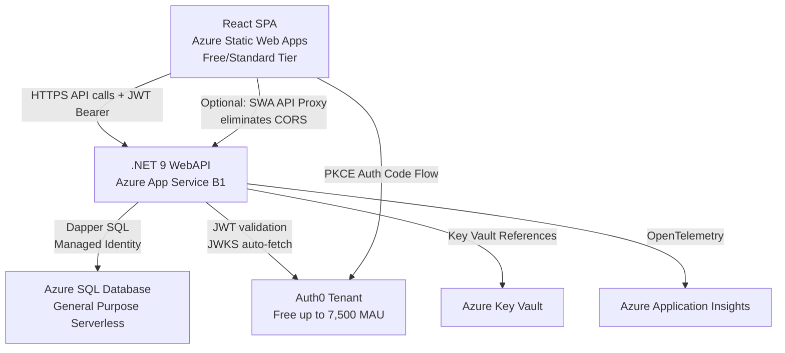

<!-- markdownlint-disable-file -->
# Task Research: Swimomatic Modernization

Swimomatic is a 10+ year-old ASP.NET MVC 3 / .NET 4.0 swim meet management web application. The modernization goal is a **SaaS multi-sport athlete management platform** delivered as a .NET 9 WebAPI backend + Vite/React SPA frontend. Swim meet management is the **first sport domain**; Track & Field and additional sports will be added as separate domain modules. The **athlete/user is the central entity** common across all sports. Tenants are leagues or sports organizations. Deployment target: Azure App Service + Azure SQL, Auth0 for authentication.

> **See also:** `swimomatic-saas-multisport-research.md` for the full SaaS tenancy model, multi-sport architecture, and athlete identity design. `swimomatic-admin-features-research.md` for admin feature detail.

## Task Implementation Requests

* Modernize backend from ASP.NET MVC 3 to ASP.NET Core .NET 9 WebAPI — structured as a SaaS multi-sport platform
* Replace jQuery/Razor views with Vite + React SPA — sport modules as lazy-loaded route groups
* Migrate authentication from Forms Auth to Auth0 — with SaaS tenant identification via custom claim
* Target Azure App Service + Azure SQL — shared schema + Row Level Security for multi-tenancy
* Keep Dapper + stored procedures for data access
* Deliver core swim features first; architect for multi-sport extensibility from day one
* Defer: PDF reports, admin features; browser-based print replaces ActiveReports

## Scope and Success Criteria

* Scope: Full analysis of existing codebase, SaaS + multi-sport architecture design, API endpoint mapping, data model assessment, Auth0 multi-tenant integration, React SPA structure, deployment architecture
* Assumptions:
  * Existing SQL Server stored procedures are preserved (Dapper strategy)
  * The LAAF code-generation framework is NOT carried forward; its generated code is reverse-engineered
  * The database schema migrates to Azure SQL with `dbo.*` (platform) and `swim.*` (sport-specific) schema organization
  * Auth0 replaces ASP.NET Membership / Forms Authentication; custom `tenant_id` claim identifies SaaS tenants
  * ActiveReports is dropped; browser print CSS replaces PDF reports
  * `Swimmer` entity is renamed to `Athlete` at the platform level; swim-specific extension goes in `swim.SwimProfile`
* Success Criteria:
  * SaaS tenancy model defined (shared schema + RLS selected)
  * Central athlete identity schema defined
  * `ISportModule` extension contract defined for sport domain libraries
  * Clear API surface area with sport-prefixed routes (`/api/swim/...`)
  * Auth0 multi-tenant configuration pattern defined
  * React SPA structure with lazy-loaded sport modules
  * Phased implementation plan with Phase 0 (SaaS foundation) before Phase 1 (core swim features)

## Outline

1. Existing codebase inventory
2. Domain model analysis
3. API surface area mapping (controllers → endpoints)
4. Database strategy (Azure SQL vs Cosmos DB per entity)
5. Authentication with Auth0
6. Frontend (Vite + React) structure
7. Azure deployment architecture
8. Phased implementation roadmap

## Potential Next Research

* Auth0 Fine-Grained Authorization (FGA) at `docs.fga.dev`
  * Reasoning: Supports relationship-based auth ("user X is admin of team Y") — may replace hybrid DB approach
* Verify `Auth0.AspNetCore.Authentication.Api` NuGet package .NET 9 compatibility
* Refresh token rotation configuration for long-lived SPA sessions
* Azure SQL Elastic Pool pricing for dev/staging/prod environments
* Azure App Service deployment slots (staging → production swap)
* Dapper + IAsyncEnumerable streaming for large heat sheet result sets

## Research Executed

### Codebase File Analysis

* SwimomaticMVC\Web.config
  * ASP.NET MVC 3, .NET 4.0 target
  * Forms authentication (`~/Account/LogOn`, timeout 2880 min)
  * Custom LAAF Logger config (database + email + text file)
  * SQL Server connection: `lasrv4\lasql2008`, database `SwimomaticDev`
  * Service provider type resolved via AppSettings key
  * ReCaptcha keys present (public/private)
  * Unity IoC container used in ControllerBase

* SwimomaticMVC\Controllers\ControllerBase.cs
  * Base class for all controllers
  * Resolves `ICacheService` via Unity container
  * `SwimomaticBusinessManager` lazy-initialized per request
  * `CurrentUser` stored in `HttpContext.Cache` (not Session) — shared cache, NOT per-user safe
  * Mobile detection via custom `CustomMobileViewEngine`
  * ActiveReports PDF export dependencies

* SwimomaticMVC\Controllers\AccountController.cs
  * Forms authentication service abstraction (`IFormsAuthenticationService`)
  * ReCaptcha for registration
  * Facebook/Twitter social login helpers (Microsoft.Web.Helpers)
  * Password reset workflow
  * Account editing (name, city, email)

* SwimomaticMVC\Controllers\SwimMeetController.cs
  * Multi-step wizard pattern (client-side show/hide of divs)
  * `SwimMeetTypeID`: 1=Dual-Triangle, 3=Invitational-Championship
  * Saves SwimMeet then bulk-replaces SwimMeetTeams (delete all + re-insert)
  * Admin check: `IsAdmin` flag per user per swim meet
  * References leagues, seasons, teams, locations in wizard steps

* SwimomaticMVC\Controllers\HeatSheetController.cs
  * HeatSheet per SwimMeet with PoolConfig
  * Admin-gated actions
  * HeatSheetEvents as child entities

* SwimomaticMVC\Controllers\ResultController.cs
  * Heat-level result entry
  * Swim meet totals and per-user results
  * Score calculation triggered server-side

* SwimomaticMVC\Controllers\LeagueController.cs
  * League → Season → TeamSeason hierarchy
  * TeamLeagueRequest approval workflow
  * Admin-gated approve action

* SwimomaticMVC\Controllers\SwimmerController.cs
  * Swimmers linked to users (UserSwimmer relationship)
  * Team search with region/city filtering
  * SwimmerTeamRequest workflow (join request → admin approval)

* SwimomaticDataLib\SwimomaticEntityContext.cs / _SwimomaticEntityContext.cs
  * LAAF-generated code (2009/2012 dates)
  * Service provider pattern wrapping all managers
  * Each manager handles one entity type
  * No EF/LINQ-to-SQL — pure custom DAL

* SwimomaticDataLib\Swimomatic.ServiceProvider\SwimomaticServiceProviderSQL.cs
  * ADO.NET SqlConnection/SqlTransaction directly
  * ReadUncommitted isolation level for reads
  * Connection string from AppSettings

* SwimomaticBusinessLib\SwimomaticBusinessManager.cs
  * Single business manager class for all domain operations
  * Seeds: MostRecent, SeasonBest, PersonalBest (seed time types)
  * Scoring event types: Heat, Final, Consolation
  * Parallel/concurrent operations (System.Threading.Tasks, ConcurrentBag)

### Domain Entity Inventory

#### Core Swim Meet Entities
| Entity | Description |
|--------|-------------|
| SwimMeet | A swim meet event (type, dates, location, season) |
| HeatSheet | Heat sheet for a swim meet |
| HeatSheetEvent | An event within a heat sheet (stroke, distance, age class, gender) |
| HeatSheetTeam | Teams competing in a heat sheet |
| Heat | Individual heat within a HeatSheetEvent |
| HeatSwimmer | A swimmer assigned to a lane in a heat |
| LaneSequence | Lane ordering configuration |
| Result | Race result (time, DQ, scratch) |
| Split | Split times within a result |
| Score | Calculated score for a result |

#### Organization Entities
| Entity | Description |
|--------|-------------|
| League | Top-level organization |
| Season | A season within a league |
| Team | A swim team |
| TeamSeason | Team participating in a season |
| TeamLeagueRequest | Team requesting to join a league season |
| Location | Physical location/venue |
| Pool | Pool at a location |
| PoolConfig | Pool configuration (lanes, distances) |
| Region | Geographic region |

#### Participant Entities
| Entity | Description |
|--------|-------------|
| Swimmer | A swimmer profile |
| SystemUser | Application user account |
| Profile | User profile data |
| UserSwimmer | Links user to swimmer |
| UserTeam | Links user to team (admin/member) |
| UserLeague | Links user to league (admin/member) |
| UserSwimMeet | Links user to swim meet |
| SwimmerTeamRequest | Swimmer requesting to join a team |
| SwimmerTeamSeason | Swimmer on a team in a season |

#### Reference Data
| Entity | Description |
|--------|-------------|
| AgeClass | Age group classification |
| AgeClassRule | Rules for age group eligibility |
| Stroke | Swimming stroke type |
| SwimEvent | Swim event definition (stroke + distance) |
| ScoringScheme | Point scoring configuration |
| SeasonScoringScheme | Scoring scheme for a season |
| UOM | Unit of measure (yards/meters) |
| ProfileSystemUser | Role/profile system user link |
| RoleSystemUser | Role assignments |
| Role | User roles |
| ReportHeatSheetEvent | Report-specific heat sheet event view |

### Controller → API Endpoint Mapping

#### AccountController → /api/auth
| MVC Action | HTTP | Endpoint | Notes |
|-----------|------|----------|-------|
| LogOn (GET) | — | Handled by Auth0 redirect | SPA redirect to Auth0 |
| LogOn (POST) | — | Handled by Auth0 | |
| LogOff | POST | /api/auth/logout | Clear session, revoke token |
| Register | POST | /api/auth/register | Delegate to Auth0 Management API |
| ResetPassword | POST | /api/auth/reset-password | Auth0 Universal Login handles this |
| AccountEdit (GET) | GET | /api/users/me | Return current user profile |
| AccountEdit (POST) | PUT | /api/users/me | Update user profile |
| ChangePassword | POST | — | Auth0 handles password changes |

#### HomeController → Static/SPA
| MVC Action | Notes |
|-----------|-------|
| Index | React SPA handles routing |
| About | React SPA static page |

#### SwimMeetController → /api/swimmeets
| MVC Action | HTTP | Endpoint |
|-----------|------|----------|
| Index | GET | /api/swimmeets (user's meets) |
| SwimMeets | GET | /api/swimmeets (same, remove child action) |
| Leagues | GET | /api/leagues (move to league endpoint) |
| SaveSwimMeet | POST/PUT | /api/swimmeets |
| DeleteSwimMeet | DELETE | /api/swimmeets/{id} |
| (other actions) | GET | /api/swimmeets/{id} |

#### HeatSheetController → /api/heatsheets
| MVC Action | HTTP | Endpoint |
|-----------|------|----------|
| Index | GET | /api/heatsheets/{swimMeetId} |
| SwimMeet | GET | /api/swimmeets/{id} |
| HeatSheets | GET | /api/heatsheets?swimMeetId={id} |
| (generate) | POST | /api/heatsheets/generate |
| (save heats) | POST | /api/heatsheets/{id}/heats |

#### ResultController → /api/results
| MVC Action | HTTP | Endpoint |
|-----------|------|----------|
| Index | GET | /api/results/{heatSheetEventId} |
| HeatSheetEventResults | GET | /api/results?heatSheetEventId={id} |
| SaveHeatSheetEventResults | POST | /api/results |
| SwimMeetResults | GET | /api/swimmeets/{id}/results |
| SwimMeetResultsByUser | GET | /api/swimmeets/{id}/results?userId={id} |

#### LeagueController → /api/leagues
| MVC Action | HTTP | Endpoint |
|-----------|------|----------|
| Leagues | GET | /api/leagues |
| League | GET | /api/leagues/{id} |
| Seasons | GET | /api/leagues/{id}/seasons |
| Season | GET | /api/seasons/{id} |
| TeamSeasons | GET | /api/seasons/{id}/teams |
| TeamLeagueRequests | GET | /api/seasons/{id}/join-requests |
| ApproveRequest | POST | /api/seasons/{id}/join-requests/{requestId}/approve |
| SaveLeague | POST/PUT | /api/leagues |

#### SwimmerController → /api/swimmers
| MVC Action | HTTP | Endpoint |
|-----------|------|----------|
| Index | GET | /api/swimmers (current user's) |
| Swimmer | GET | /api/swimmers/{id} |
| TeamSearch | GET | /api/teams/search?regionId={id}&city={city} |
| SwimmerTeamRequest | POST | /api/swimmers/{id}/join-requests |
| SaveSwimmerTeamRequest | POST | /api/teams/{teamSeasonId}/join-requests |

#### TeamController → /api/teams
| MVC Action | HTTP | Endpoint |
|-----------|------|----------|
| (CRUD) | GET/POST/PUT/DELETE | /api/teams |

#### LocationController → /api/locations
#### PoolController → /api/pools

### Key Modernization Decisions

#### CurrentUser Thread Safety Issue
The original code stores `CurrentUser` in `HttpContext.Cache["CurrentUser"]` — this is a shared application-level cache, not per-user, which is a bug. In the new app, user identity comes from JWT claims (Auth0 sub claim).

#### LAAF Framework Replacement
The LAAF code-generated files (underscore prefix = base, non-underscore = extension point) will be replaced by:
- Dapper extension methods or a thin repository layer
- Stored procedures mapped via Dapper's `QueryAsync<T>` and `ExecuteAsync`
- No code generation needed — explicit repository classes per aggregate

#### Business Manager Decomposition
`SwimomaticBusinessManager` is a 1000+ line God class. It should be decomposed into domain services:
- `SwimMeetService`
- `HeatSheetService` (heat generation logic)
- `ResultService` (scoring logic)
- `LeagueService`
- `SwimmerService`

## Key Discoveries

### Project Structure

* 4-project solution: MVC, BusinessLib, DataLib, DB
* LAAF code generator created all DAL code (2009-2012) — generated files are underscored base classes with empty subclasses for extension
* No tests for business logic (SwimomaticMVC.Tests only has Controllers folder — likely empty or minimal)
* Mobile view engine suggests original had mobile views; React SPA handles responsiveness natively

### Implementation Patterns

* **Approval workflows**: TeamLeagueRequest, SwimmerTeamRequest — both need admin approval endpoints
* **Wizard pattern**: SwimMeet creation is a multi-step wizard — React SPA handles this with component state machine
* **Admin flags**: Per-entity admin flags (IsAdmin on UserTeam, UserLeague, UserSwimMeet) — maps to claims/roles in Auth0 or custom claims
* **Seed times**: Complex seed time calculation (MostRecent, SeasonBest, PersonalBest) — stays in service layer
* **Heat generation**: Complex algorithm for assigning swimmers to heats/lanes — stays in .NET service layer, NOT client-side

### Database Analysis

The `SwimomaticDB` project contains the SQL schema. The DAL uses stored procedures exclusively (custom LAAF-generated sproc calls). For the modernized app:

* **Azure SQL** is appropriate for all relational entities (meets, heats, results, teams, swimmers)
* **Cosmos DB consideration**: The user asked about it, but the domain is inherently relational — foreign keys are critical (SwimMeet → HeatSheet → HeatSheetEvent → Heat → HeatSwimmer → Result). Cosmos DB would introduce complexity without clear benefit for this domain. **Recommendation: Keep everything in Azure SQL.**

## Technical Scenarios

### Scenario 1: Backend Architecture — .NET 9 WebAPI with Dapper

**Description:** ASP.NET Core .NET 9 controller-based WebAPI with Dapper for stored procedure calls, layered architecture, Managed Identity for Azure SQL.

**Requirements:**
* .NET 9, ASP.NET Core WebAPI
* Dapper for stored procedure calls (`Microsoft.Data.SqlClient` — NOT legacy `System.Data.SqlClient`)
* Auth0 JWT bearer validation
* CORS configured for React SPA origin
* Clean layered architecture: Controllers → Services → Repositories

**Dapper best practices discovered:**
* Register `IDbConnectionFactory` as **Singleton**; open a `SqlConnection` per-operation inside `using` blocks (NOT injected `IDbConnection`)
* Stored procedures: `QueryAsync<T>("spName", params, commandType: CommandType.StoredProcedure)`
* Output parameters: Use `DynamicParameters` with `ParameterDirection.Output`; call `p.Get<T>("@ParamName")` after execute
* Transactions: `conn.Open()` + `conn.BeginTransaction()` + pass `transaction:` arg to each Dapper call
* Multi-mapping for JOINs: `Query<A, B, A>(sql, (a, b) => { a.B = b; return a; }, splitOn: "ColumnName")`
* Use `QueryMultiple` for multiple result sets in one stored procedure round trip
* Managed Identity connection string: `Server=.database.windows.net;Database=SwimomaticProd;Authentication=Active Directory Default`

**Preferred Approach:** Controller-based WebAPI (not Minimal API) — better suited for 40+ entity domain with many endpoints, aligns with existing MVC familiarity.

```text
SwimomaticAPI/
  Controllers/
    SwimMeetsController.cs
    HeatSheetsController.cs
    ResultsController.cs
    LeaguesController.cs
    SwimmersController.cs
    TeamsController.cs
    LocationsController.cs
    PoolsController.cs
    UsersController.cs
  Services/
    SwimMeetService.cs
    HeatSheetService.cs     ← heat generation algorithm lives here
    ResultService.cs        ← scoring algorithm lives here
    LeagueService.cs
    SwimmerService.cs
  Repositories/
    SwimMeetRepository.cs
    HeatSheetRepository.cs
    ResultRepository.cs
    LeagueRepository.cs
    SwimmerRepository.cs
  Models/
    DTOs/         (request/response DTOs — separate from domain entities)
    Entities/     (domain entities ported from SwimomaticDataLib)
  Infrastructure/
    SqlConnectionFactory.cs   (IDbConnectionFactory implementation)
    Auth0Config.cs
  Program.cs
```

**DI Registration:**
```csharp
// Program.cs
builder.Services.AddSingleton<IDbConnectionFactory>(_ =>
    new SqlConnectionFactory(builder.Configuration.GetConnectionString("DefaultConnection")));
builder.Services.AddScoped<ISwimMeetRepository, SwimMeetRepository>();
builder.Services.AddScoped<ISwimMeetService, SwimMeetService>();
```

```csharp
// SqlConnectionFactory.cs
public class SqlConnectionFactory(string connectionString) : IDbConnectionFactory
{
    public SqlConnection CreateConnection() => new SqlConnection(connectionString);
}
```

#### Considered Alternatives
* Minimal API: Rejected — too verbose for 40+ entity domain without good organization
* EF Core: Rejected by user preference; existing stored procedures are an asset that preserves proven query logic

### Scenario 2: Authentication — Auth0 + .NET 9 + React

**Description:** Auth0 handles authentication. React SPA uses Auth0 React SDK (PKCE flow). .NET 9 WebAPI validates Auth0-issued JWTs. Per-entity admin roles (team admin, league admin, meet admin) are stored in the application database — NOT in Auth0 tokens.

**Requirements:**
* Auth0 tenant with Single Page Application (React) and API definitions
* React: `@auth0/auth0-react` SDK
* .NET 9: `Microsoft.AspNetCore.Authentication.JwtBearer`

**Critical gotchas discovered:**
* Auth0 scopes arrive as a single space-separated string — `RequireClaim("scope", "read:heats")` **does not work**. Requires a `HasScopeHandler` to split and check.
* Auth0 RBAC roles are **not** in the token by default — require a Post-Login Action to inject them as a custom namespaced claim.
* CORS `app.UseCors()` must come **before** `UseAuthentication()`.
* The `audience` param in React's `authorizationParams` is mandatory to receive a JWT access token (not an opaque token).

**Preferred Approach:**

React SPA config:
```tsx
// main.tsx
<Auth0Provider
  domain={import.meta.env.VITE_AUTH0_DOMAIN}
  clientId={import.meta.env.VITE_AUTH0_CLIENT_ID}
  authorizationParams={{
    redirect_uri: window.location.origin,
    audience: import.meta.env.VITE_AUTH0_AUDIENCE
  }}
>
  <App />
</Auth0Provider>
```

Calling the API with token:
```tsx
const { getAccessTokenSilently } = useAuth0();
const token = await getAccessTokenSilently();
const response = await fetch('/api/swimmeets', {
  headers: { Authorization: `Bearer ${token}` }
});
```

.NET 9 WebAPI config:
```csharp
// Program.cs
builder.Services.AddAuthentication(JwtBearerDefaults.AuthenticationScheme)
    .AddJwtBearer(options => {
        options.Authority = $"https://{builder.Configuration["Auth0:Domain"]}/";
        options.Audience = builder.Configuration["Auth0:Audience"];
    });
// HasScopeHandler for scope checking
builder.Services.AddSingleton<IAuthorizationHandler, HasScopeHandler>();
builder.Services.AddAuthorization(options => {
    options.AddPolicy("read:meets", policy =>
        policy.Requirements.Add(new HasScopeRequirement("read:meets", domain)));
});
```

**Per-entity admin authorization (hybrid approach):**

Since Auth0 RBAC is global-only, entity-scoped roles are stored in the app database:
```csharp
// UserSwimMeet, UserTeam, UserLeague tables already have IsAdmin flag
// Custom authorization handler checks DB
public class SwimMeetAdminHandler : AuthorizationHandler<SwimMeetAdminRequirement>
{
    protected override async Task HandleRequirementAsync(
        AuthorizationHandlerContext context,
        SwimMeetAdminRequirement requirement)
    {
        var userId = context.User.FindFirst(ClaimTypes.NameIdentifier)?.Value; // Auth0 sub
        var meetId = // extract from route
        var isAdmin = await _userSwimMeetRepo.IsAdminAsync(userId, meetId);
        if (isAdmin) context.Succeed(requirement);
    }
}
```

### Scenario 3: Database — Azure SQL vs Cosmos DB

**Description:** Evaluate which entities, if any, should move to Cosmos DB.

**Analysis:**
| Factor | Azure SQL | Cosmos DB |
|--------|-----------|-----------|
| Relational data | Excellent | Poor (no joins) |
| Swim domain (highly relational) | Best fit | Poor fit |
| Existing stored procedures | Preserved | Must rewrite all |
| ACID transactions | Full support | Limited |
| Query patterns | Complex joins | Simple key lookups |
| Scaling needs | Moderate (swim league) | Massive scale (not needed) |

**Recommendation:** All entities remain in Azure SQL. The swim domain is inherently relational (HeatSheet → Events → Heats → Swimmers → Results is a 5-level hierarchy with foreign keys). Cosmos DB would require denormalization that conflicts with the domain model and would require rewriting all stored procedures.

**Cosmos DB potential:** The only candidate entities would be application logs or user activity/audit events — these are write-once, high-volume, no-join patterns. But this is out of scope for core features.

### Scenario 4: Frontend — Vite + React SPA Structure

**Description:** Vite + React + TypeScript SPA with feature-sliced architecture, React Router v7, TanStack Query v5 for server state, shadcn/ui component library.

**Requirements:**
* Vite + React + TypeScript (`pnpm create vite@latest --template react-ts`)
* React Router v7 for SPA routing
* TanStack Query v5 for API data fetching/caching
* Auth0 React SDK (`@auth0/auth0-react`)
* shadcn/ui with Tailwind CSS
* React Hook Form + Zod for validation

**shadcn/ui setup gotcha:** Requires `@/*` path alias in BOTH `tsconfig.json` AND `tsconfig.app.json`, then in `vite.config.ts`, THEN run `pnpm dlx shadcn@latest init`.

**Preferred Approach:** Feature-sliced architecture (domain-based folders):

```text
swimomatic-spa/
  src/
    features/
      swim-meets/
        components/    (SwimMeetCard, SwimMeetForm, SwimMeetWizard)
        hooks/         (useSwimMeets, useSwimMeet, useCreateSwimMeet)
        pages/         (SwimMeetsPage, SwimMeetDetailPage)
        types.ts
      heat-sheets/
        components/    (HeatSheetGrid, HeatEventRow, LaneCell)
        hooks/         (useHeatSheets, useGenerateHeatSheet)
        pages/         (HeatSheetPage)
        types.ts
      results/
        components/    (ResultEntryForm, ResultsTable, ScoreSummary)
        hooks/         (useResults, useSaveResults)
        pages/         (ResultEntryPage, MeetResultsPage)
        types.ts
      leagues/
      swimmers/
      teams/
    api/               (typed fetch wrappers)
      client.ts        (shared fetch wrapper with auth token injection)
      swimMeets.ts
      heatSheets.ts
      results.ts
    components/
      ui/              (shadcn/ui components)
      layout/          (AppShell, NavBar, Sidebar)
      shared/          (ProtectedRoute, LoadingSpinner, ErrorBoundary)
    hooks/
      useAuth.ts       (wrapper around useAuth0)
    lib/
      queryClient.ts   (TanStack Query client config)
    types/             (shared TypeScript interfaces)
    App.tsx
    main.tsx
  public/
  .env.local           (VITE_AUTH0_DOMAIN, VITE_AUTH0_CLIENT_ID, VITE_API_URL)
  vite.config.ts
  tailwind.config.ts
  tsconfig.json
  tsconfig.app.json
```

**TanStack Query v5 patterns:**
```tsx
// features/swim-meets/hooks/useSwimMeets.ts
export const useSwimMeets = () =>
  useQuery({ queryKey: ['swim-meets'], queryFn: swimMeetsApi.getAll });

export const useCreateSwimMeet = () => {
  const queryClient = useQueryClient();
  return useMutation({
    mutationFn: swimMeetsApi.create,
    onSuccess: () => queryClient.invalidateQueries({ queryKey: ['swim-meets'] })
  });
};
```

**Core feature pages (Phase 1):**
* `/swim-meets` — List and manage swim meets
* `/swim-meets/new` — Create swim meet wizard (multi-step)
* `/swim-meets/:id` — Swim meet detail + heat sheet overview
* `/swim-meets/:id/heat-sheets/:heatSheetId` — Heat sheet with event/lane grid
* `/swim-meets/:id/results` — Results entry form
* `/swim-meets/:id/results/summary` — Meet results summary with scores

### Scenario 5: Azure Deployment Architecture



**Services and costs:**
* **Azure Static Web Apps** — Free tier (or Standard ~$9/mo for custom backend proxy)
* **Azure App Service B1** — ~$13/mo (.NET 9 WebAPI)
* **Azure SQL General Purpose Serverless** — Pay per vCore-second (cost-efficient for low traffic)
* **Auth0** — Free tier: up to 7,500 MAU, unlimited social connections
* **Azure Key Vault** — ~$0.03/10K operations
* **Azure Application Insights** — First 5GB/month free

**Key configuration details:**
* App Service Managed Identity → SQL `CREATE USER [AppService] FROM EXTERNAL PROVIDER` → connection string `Authentication=Active Directory Default` (no password in config)
* Key Vault References in App Service config: `@Microsoft.KeyVault(VaultName=kv-swimomatic;SecretName=Auth0-ClientSecret)` (zero code change needed)
* Application Insights: **Use `Azure.Monitor.OpenTelemetry.AspNetCore`** — classic SDK retires 2027
* Azure SQL migration path: Export DACPAC from SQL Server → Import to Azure SQL via `sqlpackage`
* **Azure SQL incompatibilities to verify in existing stored procedures:** `EXECUTE AS LOGIN`, cross-database references, `msdb` usage, linked servers

**CORS configuration (if not using SWA proxy):**
```csharp
// Program.cs
builder.Services.AddCors(options => {
    options.AddPolicy("SpaOrigin", policy =>
        policy.WithOrigins(builder.Configuration["Cors:AllowedOrigin"])
              .AllowAnyMethod()
              .AllowAnyHeader());
});
app.UseCors("SpaOrigin");  // MUST be before UseAuthentication
app.UseAuthentication();
app.UseAuthorization();
```

## Phased Implementation Plan

> **Updated for SaaS + Multi-Sport Platform.** See `swimomatic-saas-multisport-research.md` for full detail on tenancy, athlete identity, and sport module architecture.

### Phase 0 — SaaS + Multi-Sport Foundation (Weeks 1–2, before Phase 1)
1. Define `Tenant`, `Sport`, `dbo.Athlete` tables alongside existing schema (migration path: `Swimmer` → `Athlete`)
2. Implement `ITenantContext`, `TenantResolutionMiddleware`, `TenantAwareConnectionFactory` (with RLS `sp_set_session_context`)
3. Add `TenantId` column to all tenant-scoped tables; implement Azure SQL RLS policies
4. Set up Auth0 Post-Login Action to inject `https://athleteplatform.com/tenant_id` custom claim
5. Define `ISportModule` interface in platform core library; scaffold `AthletePlatformAPI` host + `SwimDomain` class library
6. Create `swim.*` schema; move swim-specific tables out of `dbo`

### Phase 1 — Foundation (Weeks 3–6)
1. Create Azure resources (App Service, Azure SQL, Static Web App, Key Vault)
2. Migrate database schema to Azure SQL with `dbo.*` / `swim.*` schema split
3. Configure Auth0 tenant + React SDK integration with custom `tenant_id` claim
4. Set up Vite + React SPA scaffold with routing, Auth0, and sport-aware navigation

### Phase 2 — Core Swim Features (Weeks 7–12)
1. Swim Meet CRUD API (`/api/swim/meets`) + React pages
2. Heat Sheet generation API + React grid view
3. Result entry API + React entry form
4. Athlete management API + pages (using `dbo.Athlete`)
5. Basic scoring display

### Phase 3 — Organization Features (Weeks 13–16)
1. League/Season management
2. Team management + join request workflows
3. Athlete team request workflows
4. Location/Pool management

### Phase 4 — Admin + Polish (Weeks 17–20)
1. Per-entity admin authorization (swim meet, league, team admin)
2. Browser-based print views (CSS print media queries)
3. Mobile-responsive design validation
4. Performance optimization + end-to-end testing

### Phase 5 — Multi-Sport Expansion
1. Generalize `Result` with `MeasurementType` discriminator (prerequisite for T&F)
2. Scaffold `TrackFieldDomain` class library with `ISportModule` implementation
3. Add `tf.*` schema tables; implement T&F meet, event, and result flows

### Phase 6 — Deferred
* PDF report generation (replace with browser print CSS)
* Auth0 Organizations migration (at commercial launch, ~$240/month Professional tier)
* Additional sport domains beyond Track & Field

